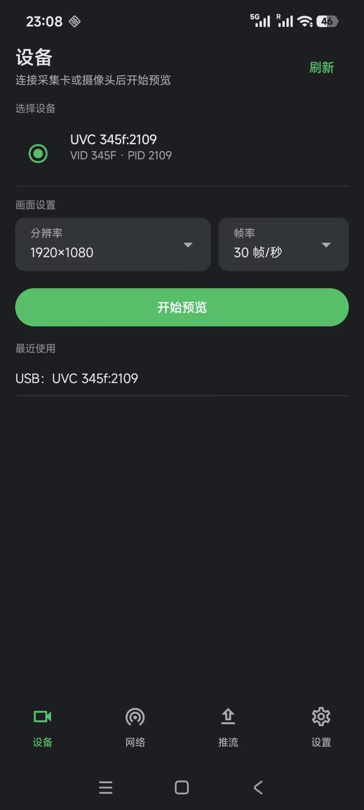

## 视频画面采集播放器

Android客户端：USB 采集卡/UVC 低延迟预览（可听 UAC 设备麦），RTMP/RTSP 网络观看，USB 画面 RTMP 推流。界面为固定暗色扁平紧凑风格；底栏为「设备 / 网络 / 推流 / 设置」，设备页为首页。

## 使用

**USB 预览** — OTG 连接设备 → 首页「设备」→ 允许 USB / 相机 / 麦克风 → 选分辨率与帧率 → 开始预览（带麦的采集卡可同步听到设备音频）。

**网络观看** —「网络」→ 输入 `rtmp://` 或 `rtsp://` 地址 → 开始观看。

**推流** — 先打开 USB 预览 → 播放页点推流图标 → 选择已保存的推流服务器与清晰度 → 打开推流开关；停止后 USB 预览可恢复。推流地址在底部「推流」Tab 管理。

## 要求与说明

- Android 7.0+；USB 采集需手机支持 OTG。
- 单路画面；分辨率/帧率/推流码率为点选，不可手动填数。
- 推流时 USB 预览会暂时中断；**网络源再推流暂不支持**。
- 局域网观看/推流更稳定；公网延迟视网络而定。

## 开发

```powershell
# Debug
.\gradlew.bat :app:assembleDebug

# 单元测试
.\gradlew.bat :app:testDebugUnitTest

# Release（R8 + shrinkResources）
.\gradlew.bat :app:assembleRelease
```

## 预览

<div style="display:inline-block">

</div>