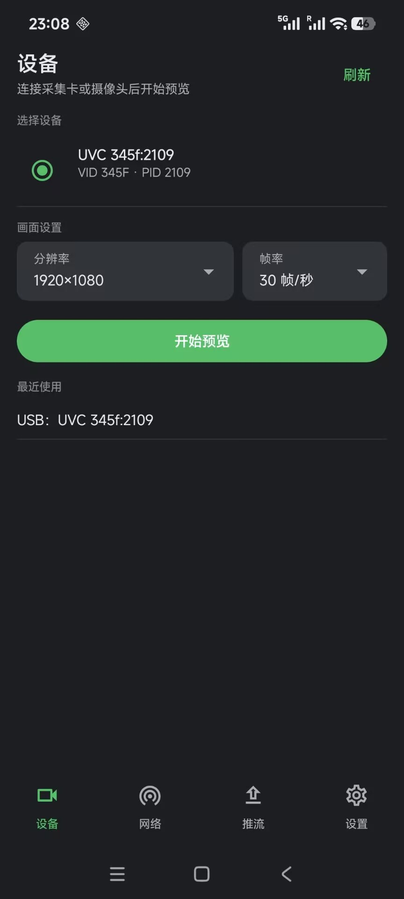

## 视频画面采集播放器

Android客户端：USB 采集卡/UVC 低延迟预览（可听 UAC 设备麦），RTMP/RTSP 网络观看，USB 画面 RTMP 推流。界面为固定暗色扁平紧凑风格；底栏为「设备 / 网络 / 推流 / 设置」，设备页为首页。

## 使用

**USB 预览** — OTG 连接设备 → 首页「设备」→ 允许 USB / 相机 / 麦克风 →「打开画面」。默认使用已选档位；需要调整时展开「画面设置」，选择分辨率与帧率。设备信息按钮可查看 VID/PID；带麦的采集卡可同步听到设备音频。

**网络观看** —「网络」→ 输入 `rtmp://` 或 `rtsp://` 地址 → 开始观看。

**推流** — 先打开 USB 画面 → 播放页点推流图标 → 选择推流地址与画质 →「开始推流」。连接中可取消连接，停止后恢复 USB 预览。推流地址在底部「推流」Tab 管理。

播放出错时，网络画面可点「重试」，USB 画面可点「返回设备」重新连接。网络地址帮助及设置页的延迟说明默认收起，点击后查看。

## 要求与说明

- Android 7.0+；USB 采集需手机支持 OTG。
- 单路画面；分辨率/帧率/推流码率为点选，不可手动填数。
- 推流时 USB 预览会暂时中断；**网络源再推流暂不支持**。
- 局域网观看/推流更稳定；公网延迟视网络而定。

## 开发

```powershell
# Debug
.\gradlew.bat :app:assembleDebug

# 单元测试
.\gradlew.bat :app:testDebugUnitTest

# Release（R8 + shrinkResources）
.\gradlew.bat :app:assembleRelease
```

## 预览

<div style="display:inline-block">

</div>
